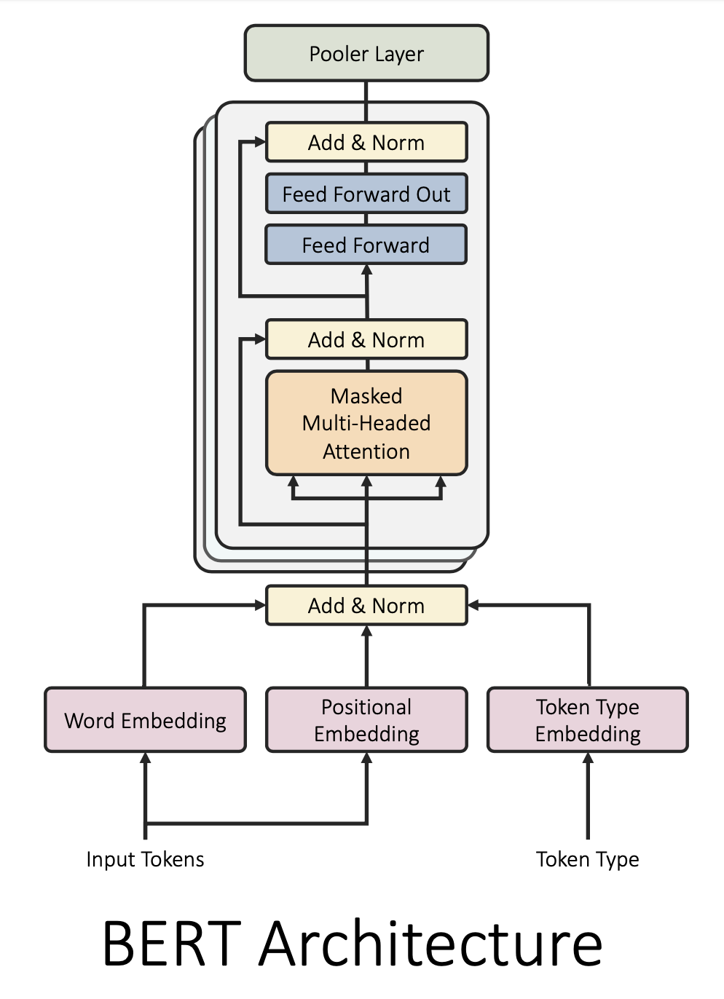

# Quantization Aware Training for BERT models

## Getting Started

Build BERT Transformer model from config or using pretrained [Tensorflow models](https://github.com/google-research/bert)
<p align="center">
  
</p>
## Example
### Downloading model
```
wget https://storage.googleapis.com/bert_models/2020_02_20/uncased_L-2_H-128_A-2.zip
unzip uncased_L-2_H-128_A-2.zip -d uncased_L-2_H-128_A-2
```
### Loading model into Tensorflow
```
import ConvertModel

model_dir = "uncased_L-2_H-128_A-2"
bert_encoder = ConvertModel.from_tf1_checkpoint(model_dir) # Tensorflow BERT models were trained using TF1
```